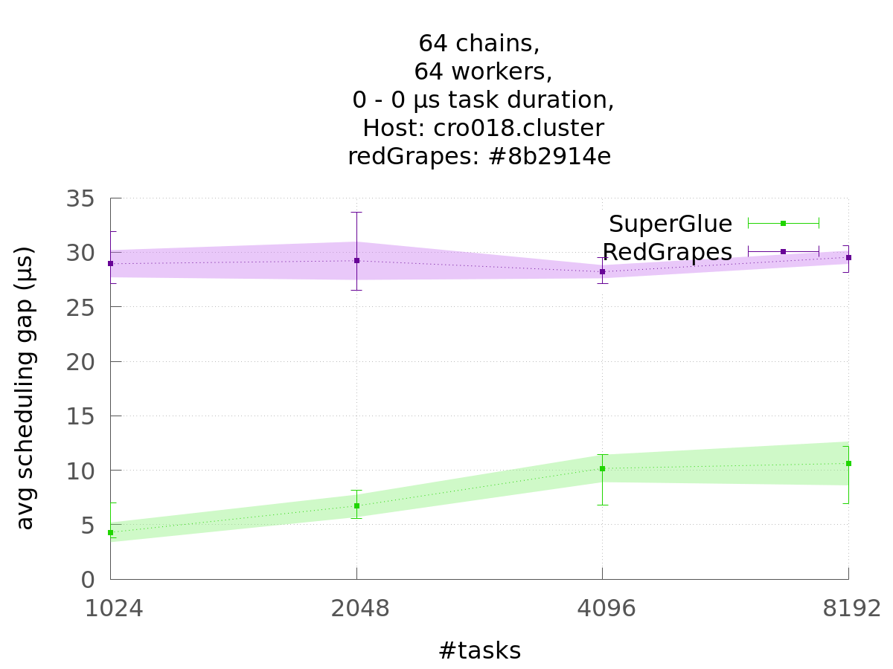
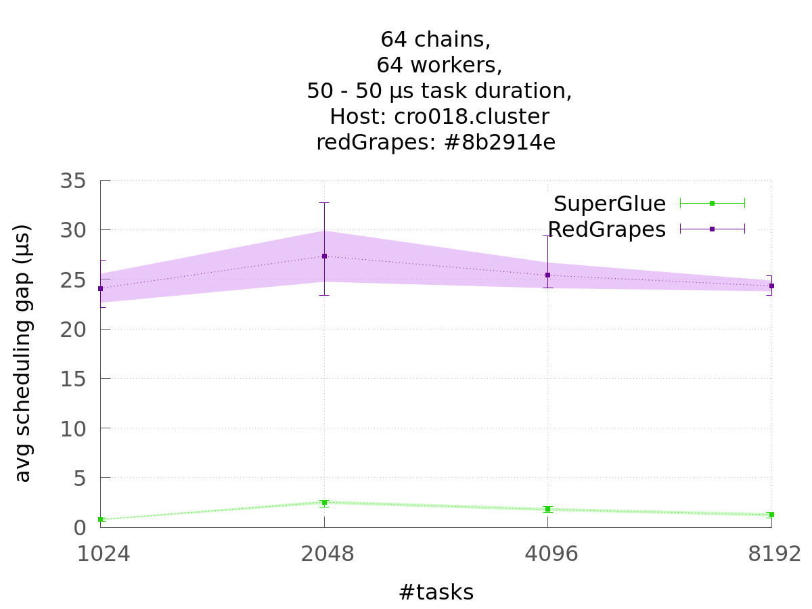
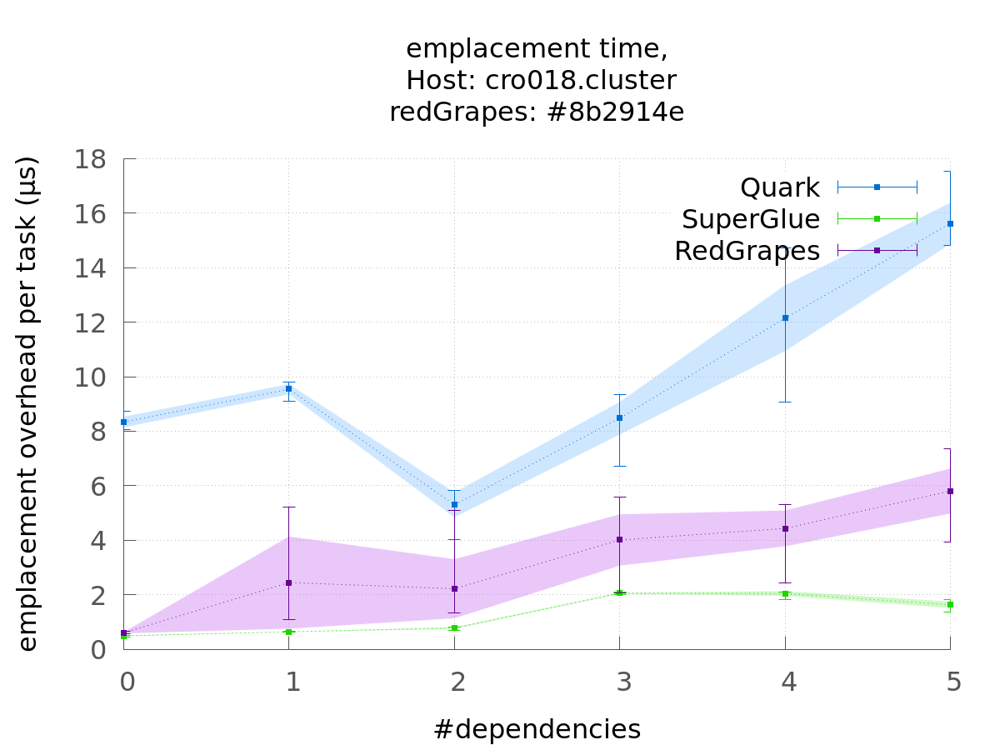
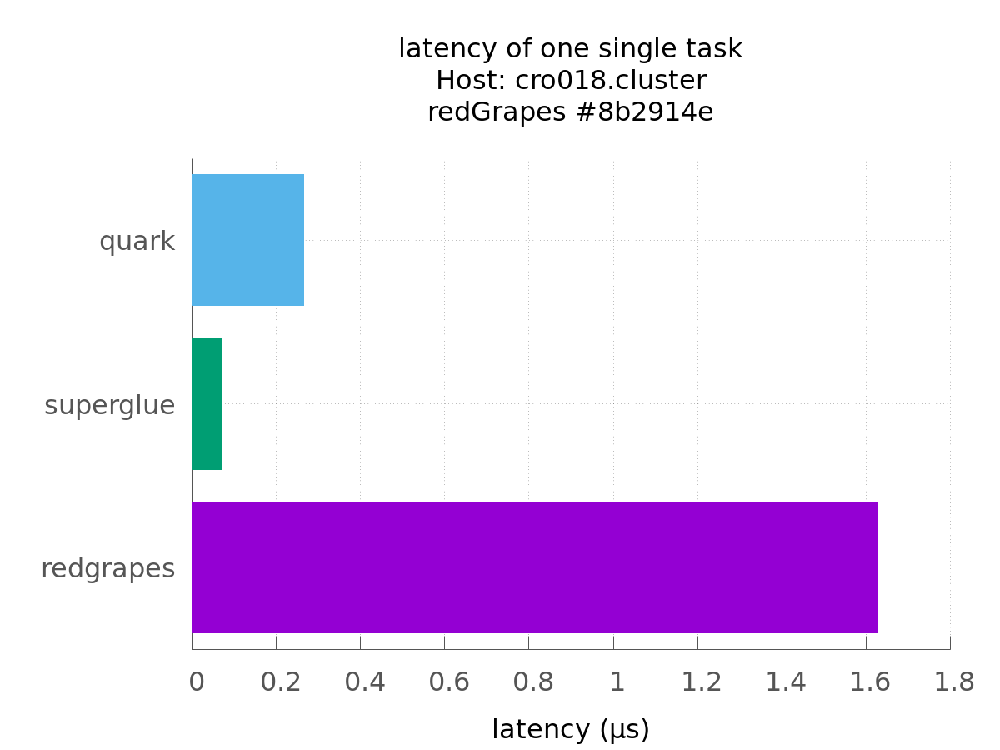

# Tasklib Benchmark
This benchmark compares *performance* and *usability* of C++ libraries for sequential task-flow programming.

#### Performance Metrics
* **natural**: total runtime of a *cholesky factorization*
* **artifical**: *total overhead*, *task-emplace overhead*, *latency* and *scheduling gap*.

#### Usability Metrics
* LOC-overhead for initialization
* LOC-overhead per task

### Competitors
* [SuperGlue](https://github.com/tillenius/superglue),
* [Quark](https://icl.utk.edu/quark/)
* [RedGrapes](https://github.com/ComputationalRadiationPhysics/redGrapes)
* *(TODO: StarPU)*

## Results
All measurements were done with an **AMD Epyc 7702** (64 cores @2.0 GHz) + 512 GB of RAM.
As compiler, we used gcc 11.2.0 with the -O3 option.

### Cholesky Factorization
We calculate a *tiled* cholesky decomposition using BLAS functions on a randomly generated matrix and measure the total runtime.

Matrix Size 4096x4096 (128MiB) | Matrix Size 8192x8192 (512MiB) |
|:-------------------:|:---------------------:|:-----------------:|
 | 

### Total Runtime Overhead
In this synthetic benchmark, we spawn a number of tasks, where each task sleeps a given amount of time to simulate a workload.
Task dependencies, if any, are generated randomly.
The resulting order of task execution is verified by calculating in each task the sha256 hash of each resource that this task touches and adding the task-id. So the final value of each resource is dependent on the execution order of the tasks. The expected results are pre-calculated sequentially and verified at the end.
As performance metric we measure the *total runtime overhead*, given by the difference between the measured and ideal execution time.
The ideal execution time is the sum of task durations along the critical path.
Then the runtime overhead is divided by the number of tasks to give an average per-task measure.

#### Total Runtime Overhead: Independent Tasks
In this case, all tasks are independent, i.e. they do not use any resources, so they could be executed in parallel and in any order.
Each task sleeps for a fixed duration of 25μs.
The ideal execution time is then given by $$ n\_tasks * task\_duration / n\_workers $$.
We measure the total execution time and take the difference to the ideal execution time and divide by the number of tasks. This yields the average overhead per task.

#### Total Runtime Overhead: Chains
Here we create tasks with exactly one dependency each. This is done by having as many resources as workers (64 in this case) and choosing the resource for each task by round-robin (task i uses resource i%64).

#### Total Runtime Overead: Random Graph
Now, for each task, the number of dependencies it has is randomly distributed, where each task has at least one dependency and at maximum five. Then, for each required dependency a unique resource is chosen which the task uses.
Since the number of workers and thus the actual amount parallelism is finite, we must be careful not to introduce potential parallelism that exceeds our practical capabilities. Otherwise, the unrealistically short critical paths would create a falsely high ovearhead measure.
Therefore the number of resources is equal to the number of workers, to limit potential parallelism.
Task length is randomized from 128μs to 512μs.

Independent Tasks | Chains | Random Graph
|:--------------:|:-----------------:|:-------------------------------------------:|
 |  | 

### Scheduling Overhead / Gap
After all tasks are created, we measure the time it takes for the runtime system to consume all tasks.
Since the tasks have an empty function-body, the overhead required for the scheduling is left.
Only a single worker is used.

Task Length: 0μs | Task Length: 50μs | Task Length: 25-500μs (linearly distributed)
|:--------------:|:-----------------:|:-------------------------------------------:|
 |  |  |

### Latency & Emplacement Overhead
Latency is measured as the time elapsed between the emplacement of a task and the begin of its execution.
Since this metric is only useful if we assume no dependencies of the task, and that the task is scheduled immediately, we measure latency only on single tasks without dependencies.

To see how this overhead further decomposes, we also look at the average time it takes to submit a task to the runtime system, called *emplacement overhead*.

$$ Latency = Emplacement Overhead + Scheduling Overhead $$

| Emplacement Overhead | Latency |
|:--------------------:|:-------:|
 | 

### Usability Benchmark

